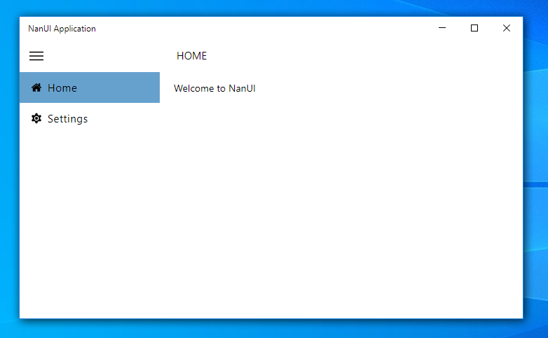

# NanUI Demos

[NanUI](https://github.com/NetDimension/NanUI)  is an open source .NET project for .NET / .NET Core developers who want to use front-end technologies such as HTML5 / CSS3 to build user interfaces for Windows Form applications.

This demo will show you how to use NanUI to make the interface of a .NET Core desktop application that made with ReactJS and [React Desktop](https://github.com/gabrielbull/react-desktop).




## Folders

**react-desktop-app** - The user interface project that created by create-react-app command.

**ReactDesktopApplicaiton** - A .NET Core 3.1 Windows Forms Application with NanUI

## NuGet packages

You should check if all dependences are all installed.

NanUI Core package

```
PM> Install-Package NetDimension.NanUI
```

NanUI Runtime package

```
PM> Install-Package NetDimension.Runtime
```

Assembly resource handler package

```
PM> Install-Package NetDimension.AssemblyResourceHandler
```

