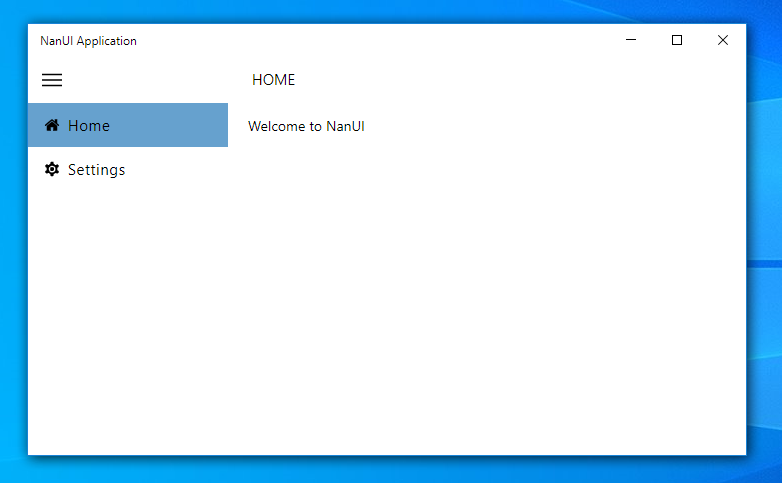

# NanUI 使用示例
## 使用React和ReactDesktop来制作一个桌面应用程序

[English](./README.en.md)

[NanUI](https://github.com/NetDimension/NanUI)是一个开放源代码的.NET项目，它适用于希望使用HTML5 / CSS3等前端技术来构建Windows窗体应用用户界面的.NET / .NET Core开发人员。

此示例将告诉您如何使用React以及[React Desktop](https://github.com/gabrielbull/react-desktop)制作一个.NET CORE 3.1桌面应用程序的用户界面。



## 文件夹说明

**react-desktop-app** - React项目，通过create-react-app命令生成。

**ReactDesktopApplicaiton** - .NET Core 3.1 Windows Forms 应用程序，主应用程序，使用了NanUI技术封装了了上面react制作的项目。


## NuGet 包

确保项目已经正确引用和安装了下面的包，这是成功运行的关键。

NanUI核心

```
PM> Install-Package NetDimension.NanUI
```

NanUI运行时

```
PM> Install-Package NetDimension.Runtime
```

嵌入式资源控制器

```
PM> Install-Package NetDimension.AssemblyResourceHandler
```

## 视频教程

本示例的制作过程已上传B站和西瓜视频

[bilibili](https://www.bilibili.com/video/av87654610/)

[西瓜视频](https://www.ixigua.com/i6791109614734672391/)
